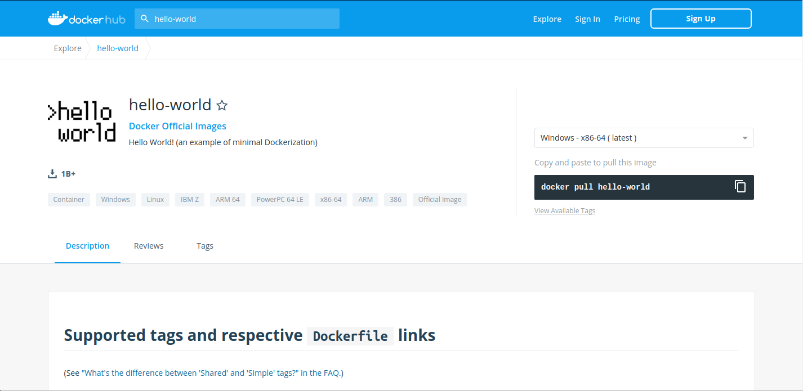
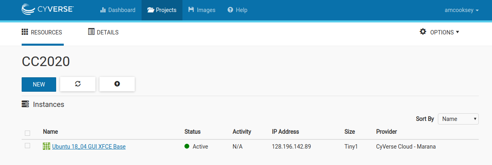
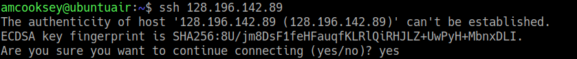
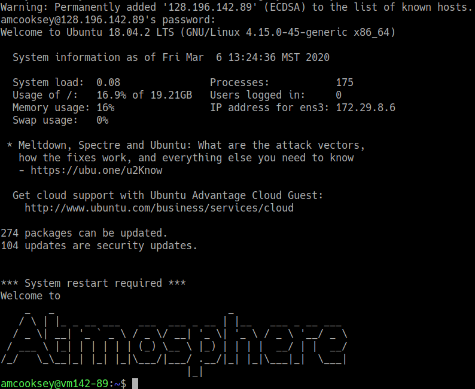

.. include:: ../cyverse_rst_defined_substitutions.txt

|CyVerse_logo2|_

|Home_Icon2|_
`Learning Center Home <http://learning.cyverse.org/>`_

**Searching image registries**
================================

**Image registry:** a storage and content delivery system, such as that used by Docker

.. Warning:: 

    Only use images from trusted sources or images for which you can see the Dockerfile. An image from an untrusted source could contain something other than what's indicated. If you can see the Dockerfile you can see exactly what is in the image.

There many public and private image registries available. Private registries tend to cost money. Public registries tend to be free.

Some examples of public/private registries to consider for your research needs:

- `Docker Hub <https://hub.docker.com/>`_ 
- `Docker Trusted Registry <https://docs.docker.com/ee/dtr/>`_
- `Amazon Elastic Container Registry <https://aws.amazon.com/ecr/>`_
- `Google Container Registry <https://cloud.google.com/container-registry/docs>`_
- `Azure Container Registry <https://azure.microsoft.com/en-us/services/container-registry/>`_
- `NVIDIA GPU Cloud <https://ngc.nvidia.com/catalog/containers>`_
- `Private Docker Registry <https://private-docker-registry.com/>`_ - not official Docker
- `Gitlab Container Registry <https://docs.gitlab.com/ce/administration/container_registry.html>`_
- `Quay <https://quay.io/>`_
- `TreeScale <https://treescale.com/>`_
- `Canister <https://www.canister.io/>`_
- `BioContainers Registry <https://biocontainers.pro/#/registry>`_

|dockerhub|
-------------

Docker Hub is a service provided by Docker for finding and sharing container images with your team. It provides the following major features:

- **Repositories:** Push and pull container images.
- **Teams & Organizations:** Manage access to private repositories of container images.
- **Official Images:** Pull and use high-quality container images provided by Docker.
- **Publisher Images:** Pull and use high- quality container images provided by external vendors. Certified images also include support and guarantee compatibility with Docker Enterprise.
- **Builds:** Automatically build container images from GitHub and Bitbucket and push them to Docker Hub.
- **Webhooks:** Trigger actions after a successful push to a repository to integrate Docker Hub with other services.

Docker Hub is the most well-known and popular image registry for Docker containers.

|biocontainerlogo|

|biocontainerreg|
------------------

BioContainers is a community-driven project that provides the infrastructure and basic guidelines to create, manage and distribute bioinformatics containers with **special focus in proteomics, genomics, transcriptomics and metabolomics**. BioContainers is based on the popular frameworks of Docker.

Although anyone can create a BioContainer, the majority of BioContainers are created by the Bioconda project. Every Bioconda package has a corresponding BioContainer available at Quay.io.

|quayio|
---------
Quay is another general image registry. It works the same way as Docker Hub. However, Quay is home to all BioContainers made by the Bioconda project. Now we will find a BioContainer image at Quay, pull that image and run it on cloud virtual machine.

**Pull an image from a registry**
----------------------------------

To run your BioContainer you will need a computer with Docker installed. 
We will use an Atmosphere cloud instance today but this can be done on any computer.

Open an Atmosphere instance
^^^^^^^^^^^^^^^^^^^^^^^^^^^^

1. Go to `Atmosphere <https://atmo.cyverse.org/>`_ and log in with your CyVerse credentials.
 
2. Click on 'projects' tab at the top of the page.

3. You should have a project called 'Conatainer Camp 2020'; click on that tile.

4. You should already have a running instance called **Ubuntu 18_04 GUI XFCE Base**. To confirm this look for a green dot and the word 'Active' under 'status'.

 |atmoactive|

5. Copy the IP address for your instance

6. Open a terminal on your computer

7. Connect to your Atmoshere instance via ssh **using the IP address you copied**

.. code-block:: bash

    $ ssh 128.196.142.89

8. You will be asked if you are sure you want to continue--say **yes**.

   |atmoauth|

9. If you see something like this (below) then you have successfully logged into your Atmophere instance.

   |atmosuccess|
 
Install Docker
^^^^^^^^^^^^^^^^^^^^^

Installing Docker on your computer takes a little time but it is reasonably straight forward and it is a one-time setup. |How to install Docker|. 

Docker installation is much easier on an Atmosphere instance with the 'ezd' command.

.. code-block:: bash

    $ ezd
    
Use 'docker pull' to get the image
^^^^^^^^^^^^^^^^^^^^^^^^^^^^^^^^^^

Go to |dockerhub| and search for 'hello-world' in the search bar at the top of the page. 

|hubfind1|

Click on the 'tag' tab to see all the available 'hello-world' images. 

Click the 'copy' icon at the right to copy the docker pull command that we will need on the command line.

Now you will need to pull the image from the registry onto your computer. Use the 'docker pull' command you copied from the registry above. 

.. Note:: 
    If you are working on a system for which you don't have root permissions you will need to use 'sudo' and provide your password. Like this:

.. code-block:: bash

   $ sudo docker pull hello-world:latest

Now list the files in your current working directory

.. code-block:: bash

   $ ls -l

Where is the image you just pulled? 
Docker saves container images to the Docker directory (where Docker is installed). You won't ever see them in your working directory.

Use 'docker images' to see all the images on your computer:

.. code-block:: bash

   $ sudo docker images

----

**Fix or improve this documentation:**

- On Github: |Github Repo Link|
- Send feedback: `Tutorials@CyVerse.org <Tutorials@CyVerse.org>`_

----

.. |Github Repo Link|  raw:: html

   <a href="https://github.com/CyVerse-learning-materials/foss-2019/tree/master/Containers/biocontainers.rst" target="blank">Github Repo Link</a>

.. |dockerdocs|  raw:: html

   <a href="https://docs.docker.com" target="blank">Docker</a>

.. |dockerhub|  raw:: html

   <a href="https://hub.docker.com" target="blank">Docker Hub</a>

.. |quayio|  raw:: html

   <a href="https://quay.io/" target="blank">Quay</a>

.. |biocontainerreg|  raw:: html

   <a href="https://biocontainers.pro/#/registry" target="blank">BioContainers Registry</a>

.. |How to install Docker|  raw:: html

   <a href="https://learning.cyverse.org/projects/container_camp_workshop_2019/en/latest/docker/dockerintro.html" target="blank">How to install Docker</a>

.. |linuxdocker|  raw:: html

   <a href="https://docs.docker.com/install/linux/docker-ce/ubuntu" target="blank">Linux platforms</a>

.. |builddocker|  raw:: html

   <a href="https://cyverse-creating-docker-containers-quickstart.readthedocs-hosted.com/en/latest/step3.html" target="blank">More information on building Docker images</a>

.. |macdocker|  raw:: html

   <a href="https://docs.docker.com/docker-for-mac/install" target="blank">Mac</a>

.. |windowsdocker|  raw:: html

   <a href="https://docs.docker.com/docker-for-windows/install" target="blank">Windows</a>
   
.. |docker| image:: ../img/docker.png
  :width: 250

.. |biocontainerlogo| image:: ../img/biocontainers5a.png
  :width: 300

